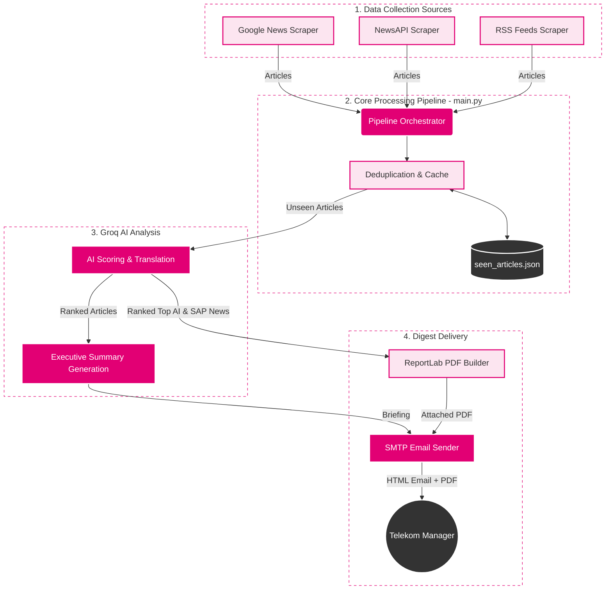

# Telekom AI News Pipeline Architecture

Here is the high-level architecture diagram of the AI News Intelligence Pipeline, styled in Deutsche Telekom's signature magenta colors.

```mermaid
graph TD
    %% Define Telekom Magenta styling
    classDef magenta fill:#E20074,stroke:#fff,stroke-width:2px,color:#fff;
    classDef lightMagenta fill:#FCE5F0,stroke:#E20074,stroke-width:2px,color:#333;
    classDef darkGrey fill:#333333,stroke:#fff,stroke-width:2px,color:#fff;

    %% Data Sources Layer
    subgraph Sources [1. Data Collection Sources]
        GN[Google News Scraper]:::lightMagenta
        NA[NewsAPI Scraper]:::lightMagenta
        RSS[RSS Feeds Scraper]:::lightMagenta
    end

    %% Processing Layer
    subgraph Processing [2. Core Processing Pipeline - main.py]
        ORCH(Pipeline Orchestrator):::magenta
        DEDUP[Deduplication & Cache]:::lightMagenta
        CACHE[(seen_articles.json)]:::darkGrey
        
        ORCH --> DEDUP
        DEDUP <--> CACHE
    end

    %% AI Analysis Layer
    subgraph AI [3. Groq AI Analysis]
        SCORE[AI Scoring & Translation]:::magenta
        EXEC[Executive Summary Generation]:::magenta
    end

    %% Output Layer
    subgraph Output [4. Digest Delivery]
        PDF[ReportLab PDF Builder]:::lightMagenta
        EMAIL[SMTP Email Sender]:::magenta
        USER((Telekom Manager)):::darkGrey
    end

    %% Connections
    GN -->|Articles| ORCH
    NA -->|Articles| ORCH
    RSS -->|Articles| ORCH
    
    DEDUP -->|Unseen Articles| SCORE
    SCORE -->|Ranked Articles| EXEC
    
    SCORE -->|Ranked Top AI & SAP News| PDF
    EXEC -->|Briefing| EMAIL
    PDF -->|Attached PDF| EMAIL
    
    EMAIL -->|HTML Email + PDF| USER

    %% Style Subgraphs
    style Sources fill:#ffffff,stroke:#E20074,stroke-width:1px,stroke-dasharray: 5 5
    style Processing fill:#ffffff,stroke:#E20074,stroke-width:1px,stroke-dasharray: 5 5
    style AI fill:#ffffff,stroke:#E20074,stroke-width:1px,stroke-dasharray: 5 5
    style Output fill:#ffffff,stroke:#E20074,stroke-width:1px,stroke-dasharray: 5 5
```
